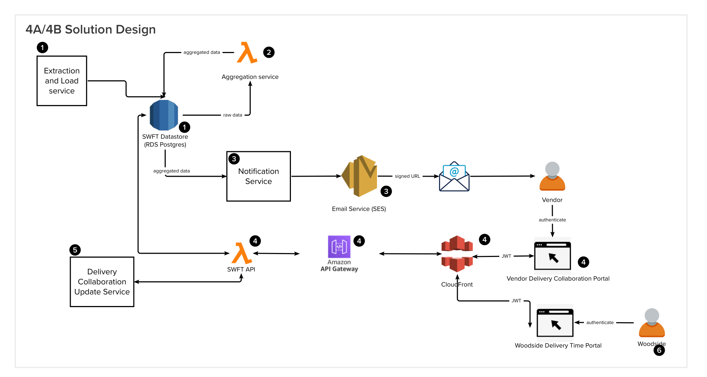

## Integrated Solution Design
<figure markdown>
  {width=50%, align=center} 
</figure>
## Major components
### Extraction and Load service (1)
#### Workflow
* See [here](https://confluence.woodside.com.au/x/LwK4Bw)

#### Prerequisites
None

#### Solution Design Discussion
The team has investigated a few options to pull C&P and Work order into SWFT.

##### Option 1

###### Description
* Extractor uses Enterprise Data Platform (EDP/Snowflake) Data APIs to extract relevant data and load into SWFT staging datastore. Snowflake will manage application access through Application Integration Schemas (AIS). The AIS aims at providing an "API contract" with guaranteed backward compatibility (through view versioning) to applications. Each application will have its own AIS created to cater for application specific data needs, security, schema etc.
* Related: See [SWFT-ADR-002](https://confluence.woodside.com.au/x/Vge4Bw)
###### Prerequisites
* Access to Data APIs and the relevant schemas
* All data must be pulled into Snowflake, cleansed, transformed and made ready for consumption via AIS and Data APIs
###### Blockers
* C&P data is not yet in Snowflake
* Other data such as Work Order is not ready for consumption via API.
* S4 upgrade in progress/planning
###### Discussion
Use a time-based trigger (AWS EventBridge event) to trigger the extractor |
###### Dependency factor
High
###### Architecture/Technical alignment
High
