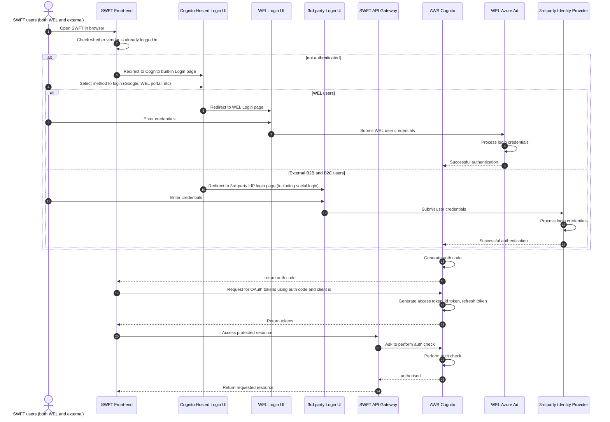

## Introduction Test
SWFT needs a secure method to enable both vendors (with no WEL accounts) and WEL users to interact with SWFT UI and APIs.

<figure markdown>
  {width=50%, align=center} 
</figure>

## Functional requirements
1. FR1: Users (WEL and external vendors) use email addresses as username to authenticate to SWFT. That means:
    * Woodside email address for WEL users
    * Business email address for vendors (B2B external users)
    * Individual email address for vendors (B2C external users) who don't have an business email setup.
1. FR2: WEL users must be able to use their existing Woodside credentials (email addresses and passwords) to authenticate to SWFT.
1. FR3: SWFT must support Single Sign On for WEL users.
1. FR4: Multiple user accounts per vendor are permitted.
1. FR5: SWFT must be able to differentiate between external users and WEL users.
    * Vendor users can only view and update material lead times belonging to their organisation.
    * WEL users can perform cross-organisation operations.
1. FR6: SWFT must comply with WEL security standards and guidelines for authentication and authorisation.
1. FR7: The auth design must support seamless transitions/migrations when other SWFT products are rolled out.
1. FR8: The auth supports approximately 20 vendors for the MVP.
1. FR9: External users must only have access to SWFT and no other WEL services.

## Non functional requirements
1. NFR1: External users should be able to use their existing email credentials (email addresses and passwords) to authenticate to SWFT. There is no need to create and manage SWFT-specific credentials.
1. NFR2: SWFT should support Single Sign On for external users. This requires:
    * B2B setup for business-email vendors
    * B2C setup for individual-email vendors
1. NFR3: External users might self sign up for SWFT if permitted to do so.
1. NFR4: SWFT uses a unified interface to authenticate both WEL users and external users.

!!! note "SWFT preferred implementation"
    * 1st preference Option 2
    * 2nd preference Option 1

## Implementation options
### Option 1 - Full federation mode - Setup AWS Cognito to federate to WEL Azure AD for WEL users, 3rd party vendor IdPs for B2B external users and social IdPs for B2C external users
* WEL users login using their WEL credentials using a federated IdP setup with WEL Azure AD. See here for a step-by-step guide on how to federate to Azure AD using SAML.
* For B2B vendor users, configure Cognito to federate to the vendor IdP (similar to WEL Azure AD). Cognito supports both SAML and OIDC IdPs.
* For or B2C vendor users, enable Social identity providers support in Cognito (such as Google, Facebook).
Use Cognito user pool as the authoriser to authorise API access (see here)

#### Pros
1. Cognito is a robust and secure Auth-As-A-Service option. Cognito is HIPAA eligible and PCI DSS, SOC, and ISO/IEC 27001, ISO/IEC 27017, ISO/IEC 27018, and ISO 9001 compliant.
1. The squad can move fast as the only dependency is to integrate with WEL Azure AD. The SWFT team controls and configures 3rd party Idp and social integrations.
1. Cognito offers a hosted login page which is hardened by AWS.
1. Fuse has implemented this pattern for Petronas users. See https://confluence.woodside.com.au/x/W6EnBg.
1. All users (WEL and external users) can use their existing credentials (usernames and passwords) to authenticate to SWFT. There is no SWFT specific credentials for vendors to manage.
1. Very flexible option with the ability to customise auth steps with AWS Lambda.

#### Cons
1. Whitelisting vendor users (in either B2B or B2C setup) requires custom Cognito authentication hooks. See here. Alternatively, for B2B accounts, the vendor can help setup custom scopes for SWFT applications.
1. Since all OAuth tokens are issued by Cognito, if SWFT API is to be hosted on Mule, there are additional auth work required.
1. Need to customise Cognito UI to have WEL look and feel.
1. Cognito has not been used in Accelerator. This would require substantial effort to get the pattern approved.
1. Overhead to maintain Cognito infrastructure and information.
1. There are some user information (email address, name) maintained outside WEL Azure AD. Having said that, there is no information identified as Confidential PIR.